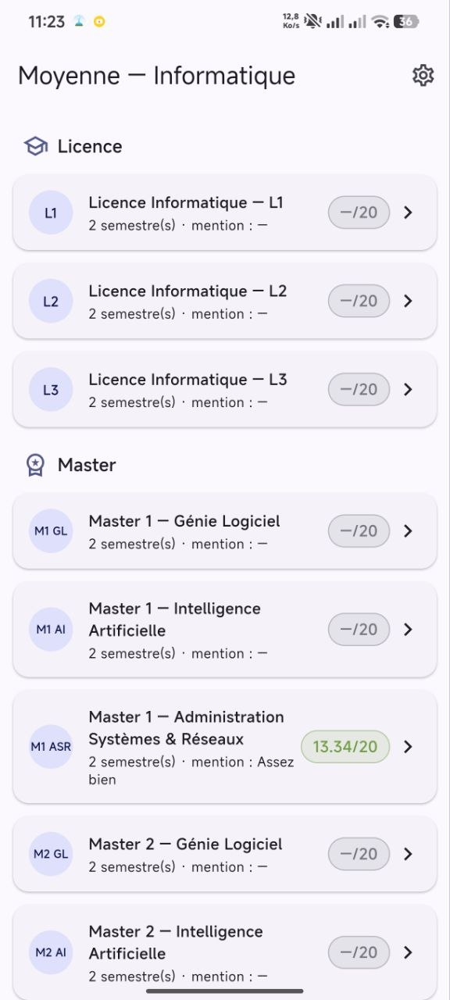
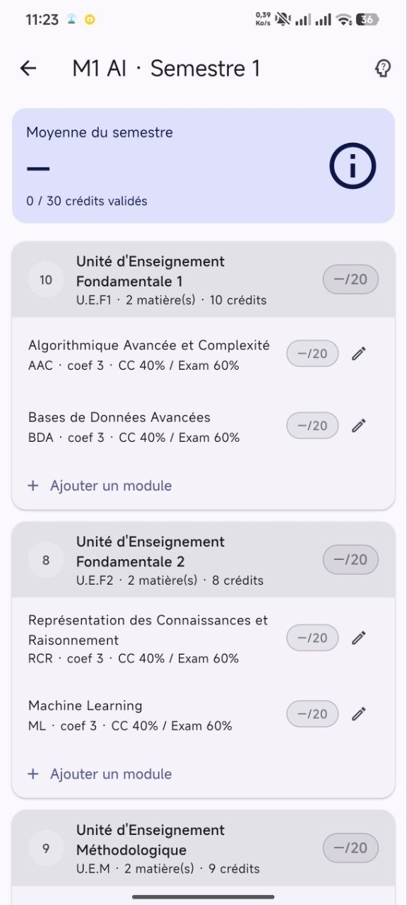
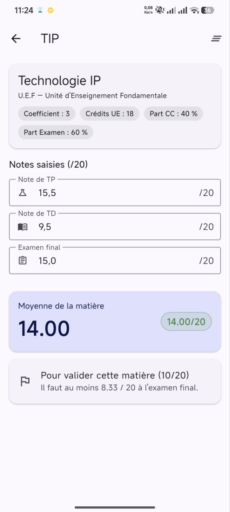
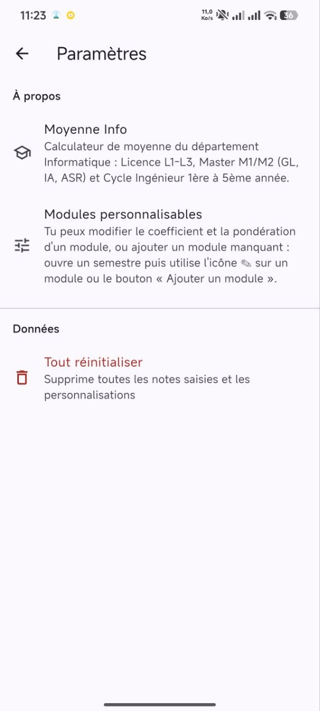
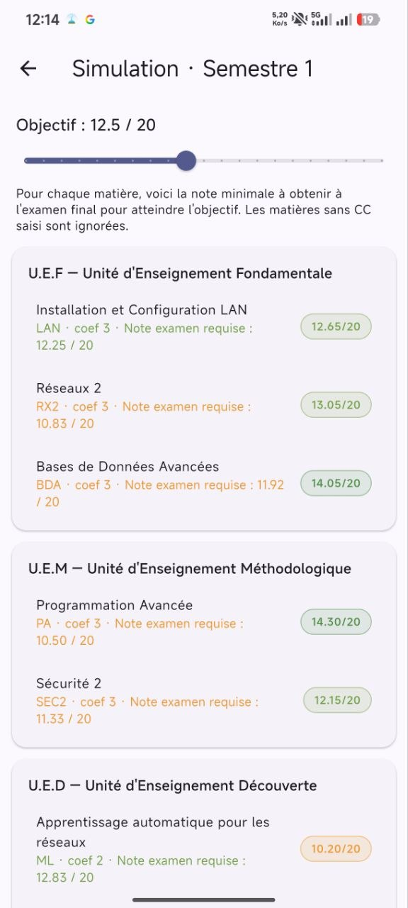

# 🎓 Moyenne Info — Calculateur de moyenne universitaire

Application mobile Flutter pour les étudiants du département Informatique .

## 📱 Aperçu

Moyenne Info permet de calculer automatiquement sa moyenne semestrielle et annuelle en saisissant ses notes de TP, TD et examen final. L'app prend en compte les coefficients, crédits et pondérations CC/Examen de chaque matière.

##📸Captures d'écran

<p float="left"> 

 
 
 
 
 
 
 
</p>

## ✨ Fonctionnalités

- 📊 Calcul de moyenne par matière, UE et semestre
- 🎯 Mode simulation : note minimale à l'exam pour atteindre un objectif
- ✏️ Modules personnalisables (coefficient, pondération CC/Examen)
- ➕ Ajout de modules manquants
- 🏫 Filières supportées : L1/L2/L3, M1/M2 (GL, IA, ASR), Cycle Ingénieur

## 🛠️ Technologies

- Flutter / Dart
- Material Design 3

## 🚀 Installation

```bash
git clone https://github.com/sofianehm06/moyenne-info.git
cd moyenne-info
flutter pub get
flutter run
```

## 👨‍💻 Auteur

**Sofiane Hammami** — Étudiant en Master Administration & Sécurité des Réseaux, Université de Béjaïa